<div align="center">

[](https://git.io/typing-svg)


*Platform Manajemen Data Terpusat Prodi D3 Teknik Informatika*

Sistem backend untuk pengelolaan database, struktur tabel, halaman admin, dan data mahasiswa Politeknik Negeri Bandung dengan arsitektur Cloud-Native.

[](https://laravel.com/)
[](https://www.postgresql.org/)
[](https://supabase.com/)

[](https://laravel-excel.com/)
[](https://jwt.io/)

</div>

<div align="center">

---

### 📈 Project Stats


</div>

---

## 📑 Table of Contents

- [📖 Tentang Proyek](#-tentang-proyek)
- [✨ Fitur Utama](#-fitur-utama)
- [🛠 Tech Stack](#-tech-stack)
- [👥 Tim Pengembang](#-tim-pengembang-kelompok-c31)
- [💻 Panduan Instalasi](#-panduan-instalasi)
- [🎯 Menjalankan Aplikasi](#-menjalankan-aplikasi)
- [📂 Struktur Folder](#-struktur-folder)
- [📊 Database Schema](#-database-schema)
- [🔌 API Documentation](#-api-documentation)
- [🚨 Troubleshooting](#-troubleshooting)
- [🤝 Cara Berkontribusi](#-cara-berkontribusi)
- [📝 Lisensi](#-lisensi)

---

## 📖 Tentang Proyek

*Polban DataHub* adalah komponen backend inti dari ekosistem *Polban Dataverse*. Aplikasi ini bertanggung jawab untuk mengelola seluruh data mahasiswa, akademik, dan administratif dengan sistem yang terstruktur dan aman.

### 🔗 Ekosistem Polban Dataverse

Proyek ini merupakan bagian dari kolaborasi tiga tim pengembang:

1. **[DataHub](https://github.com/ErsyaHasby/polban-datahub)** (Repositori ini) - Mengelola database, struktur tabel, halaman admin, dan data partisipan
2. **[DataCore](https://github.com/muhamadSyahid/polban-datacore)** - Mengagregasi data dari DataHub dan menyediakannya melalui REST API
3. **[DataView](https://github.com/ihsan-ramadhan/polban-dataview)** - Mengambil data dari API DataCore dan memvisualisasikannya kepada pengguna

### 🔄 Alur Data

```mermaid
graph LR
    A["👥 DataHub<br/>Database & Admin"] -->|Raw Data| B["⚙ DataCore<br/>API Aggregator"]
    B -->|"REST API<br/>JSON Response"| C["📊 DataView<br/>Visualization"]
    C -->|"Interactive Charts<br/>& Maps"| D["👤 End User<br/>Dashboard"]
    
    style A fill:#2196F3,stroke:#1976D2,stroke-width:2px,color:#fff
    style B fill:#FF9800,stroke:#F57C00,stroke-width:2px,color:#fff
    style C fill:#9C27B0,stroke:#7B1FA2,stroke-width:2px,color:#fff
    style D fill:#4CAF50,stroke:#388E3C,stroke-width:2px,color:#fff
```



---

## ✨ Fitur Utama

### 🗄️ Manajemen Database
- *Database Cloud*: PostgreSQL di Supabase dengan keamanan tingkat enterprise
- *Migrasi Terstruktur*: Schema database yang well-documented dan versioned
- *Seeder Data*: Data dummy untuk development dan testing
- *Backup & Recovery*: Sistem backup otomatis

### 📊 Import & Export Data
- *Excel Import*: Import massal data mahasiswa dari file Excel (.xlsx)
- *CSV Support*: Support format CSV untuk fleksibilitas
- *Data Validation*: Validasi otomatis saat import
- *Error Handling*: Laporan detail jika ada data yang error

### 🔐 Sistem Keamanan
- *Authentication*: JWT-based authentication
- *Authorization*: Role-based access control (Admin, User, Guest)
- *Activity Logging*: Pencatatan semua aktivitas user
- *IP Tracking*: Monitoring akses berdasarkan IP address

### 👨‍💼 Admin Panel
- *Dashboard Admin*: Kelola data mahasiswa, akademik, dan master data
- *User Management*: Kelola user dan permission
- *Data Master*: Kelola provinsi, kabupaten/kota, SLTA, jalur daftar
- *Activity Monitor*: Monitor aktivitas sistem real-time

---

## 🛠 Tech Stack

### Backend Framework
- *Framework*: [Laravel 11.x](https://laravel.com/)
- *PHP Version*: 8.1+
- *Package Manager*: [Composer](https://getcomposer.org/)

### Database
- *Database*: [PostgreSQL](https://www.postgresql.org/)
- *Cloud Provider*: [Supabase](https://supabase.com/)
- *ORM*: Eloquent ORM
- *Migration*: Laravel Migration System

### Libraries & Packages
- *Excel Processing*: [Maatwebsite/Laravel-Excel](https://laravel-excel.com/)
- *Authentication*: [Laravel Sanctum](https://laravel.com/docs/sanctum)
- *API Documentation*: Laravel API Resources
- *Testing*: PHPUnit

### Development Tools
- *Build Tool*: [Vite](https://vitejs.dev/)
- *Version Control*: Git
- *Code Quality*: PHP CS Fixer, PHPStan

---

## 🎨 Design Philosophy

Polban DataHub dibangun dengan prinsip:

- *🔒 Security First*: Implementasi security best practices di setiap layer
- *📊 Data Integrity*: Validasi ketat untuk memastikan konsistensi data
- *⚡ Performance*: Optimasi query dan caching untuk performa maksimal
- *🔄 Scalability*: Arsitektur yang dapat scale sesuai kebutuhan
- *📝 Documentation*: Kode yang well-documented dan mudah dipahami

---

## 🚀 Roadmap

### ✅ Phase 1 (Completed)
- [x] Setup project Laravel 11
- [x] Database schema & migrations
- [x] Model & relationships
- [x] Excel import functionality
- [x] Activity logging system

### 🚧 Phase 2 (In Progress)

---

## 🎯 Menjalankan Aplikasi

### Metode 1: Development Mode (Recommended)

Jalankan *2 terminal* secara bersamaan:

#### Terminal 1 - Laravel Server
```bash
cd datahub-backend
php artisan serve
```

#### Terminal 2 - Vite Development Server
```bash
cd datahub-backend
npm run dev
```

### Metode 2: Production Build

```bash
# Build assets untuk production
npm run build

# Jalankan Laravel server
php artisan serve
```

### 🌐 Akses Aplikasi

Buka browser dan akses:
- *Frontend*: http://127.0.0.1:8000
- *Admin Panel*: http://127.0.0.1:8000/admin (default credentials di seeder)

### 🔑 Default Admin Credentials

```
Email: admin@polban.ac.id
Password: password
```

> *⚠ PENTING*: Segera ganti password default setelah login pertama!

---

## 📂 Struktur Folder

```
polban-datahub/
├── 📁 datahub-backend/
│   ├── 📁 app/
│   │   ├── 📁 Http/
│   │   │   ├── 📁 Controllers/        # API & Web Controllers
│   │   │   │   ├── AuthController.php
│   │   │   │   ├── MahasiswaController.php
│   │   │   │   ├── ImportController.php
│   │   │   │   └── AdminController.php
│   │   │   └── 📁 Middleware/         # Custom middleware
│   │   ├── 📁 Models/                 # Eloquent Models
│   │   │   ├── User.php
│   │   │   ├── Mahasiswa.php
│   │   │   ├── MahasiswaNilai.php
│   │   │   ├── Provinsi.php
│   │   │   ├── KabupatenKota.php
│   │   │   ├── Slta.php
│   │   │   ├── JalurDaftar.php
│   │   │   ├── ActivityLog.php
│   │   │   └── ImportMahasiswa.php
│   │   ├── 📁 Services/               # Business Logic
│   │   │   └── ActivityLogService.php
│   │   └── 📁 Providers/
│   │       └── AppServiceProvider.php
│   ├── 📁 config/                     # Configuration files
│   │   ├── database.php
│   │   ├── auth.php
│   │   ├── sanctum.php
│   │   └── filesystems.php
│   ├── 📁 database/
│   │   ├── 📁 migrations/             # Database migrations
│   │   │   ├── 2025_11_11_000000_create_enum_types.php
│   │   │   ├── 2025_11_11_000001_create_users_table.php
│   │   │   ├── 2025_11_11_000002_create_activity_logs_table.php
│   │   │   ├── 2025_11_11_000003_create_slta_table.php
│   │   │   ├── 2025_11_11_000004_create_jalur_daftar_table.php
│   │   │   ├── 2025_11_11_000005_create_provinsi_table.php
│   │   │   └── ...
│   │   ├── 📁 seeders/                # Database seeders
│   │   │   ├── DatabaseSeeder.php
│   │   │   ├── ProvinsiSeeder.php
│   │   │   ├── KabupatenKotaSeeder.php
│   │   │   └── UserSeeder.php
│   │   └── 📁 factories/              # Model factories
│   │       └── UserFactory.php
│   ├── 📁 public/                     # Public assets
│   │   ├── index.php
│   │   └── 📁 images/
│   ├── 📁 resources/
│   │   ├── 📁 css/                    # Stylesheets
│   │   ├── 📁 js/                     # JavaScript/Vue
│   │   └── 📁 views/                  # Blade templates
│   ├── 📁 routes/
│   │   ├── web.php                    # Web routes
│   │   ├── api.php                    # API routes
│   │   └── console.php                # Console commands
│   ├── 📁 storage/
│   │   ├── 📁 app/                    # Uploaded files
│   │   ├── 📁 logs/                   # Application logs
│   │   └── 📁 framework/              # Framework files
│   ├── 📁 tests/                      # Unit & Feature tests
│   │   ├── 📁 Feature/
│   │   └── 📁 Unit/
│   ├── .env.example                   # Environment template
│   ├── composer.json                  # PHP dependencies
│   ├── package.json                   # Node dependencies
│   ├── phpunit.xml                    # PHPUnit configuration
│   ├── vite.config.js                 # Vite configuration
│   └── README.md                      # Backend documentation
└── README.md                          # This file
```

---

## 📊 Database Schema

### Tabel Utama

#### 1. `users` - User Management
```sql
- id (UUID)
- name (VARCHAR)
- email (VARCHAR UNIQUE)
- password (VARCHAR)
- role (ENUM: admin, user, guest)
- created_at, updated_at
```

#### 2. `mahasiswa` - Data Mahasiswa
```sql
- nim (VARCHAR PRIMARY KEY)
- nama_lengkap (VARCHAR)
- jenis_kelamin (ENUM: L, P)
- agama (VARCHAR)
- tempat_lahir (VARCHAR)
- tanggal_lahir (DATE)
- alamat (TEXT)
- provinsi_id (INTEGER FK)
- kabupaten_kota_id (INTEGER FK)
- latitude (DECIMAL)
- longitude (DECIMAL)
- slta_asal (VARCHAR FK)
- jalur_daftar_id (INTEGER FK)
- periode_id (VARCHAR FK)
- created_at, updated_at
```

#### 3. `mahasiswa_nilai` - Data Akademik
```sql
- id (SERIAL PRIMARY KEY)
- nim (VARCHAR FK)
- mata_kuliah_id (VARCHAR FK)
- nilai (DECIMAL)
- grade (VARCHAR)
- semester (INTEGER)
- tahun_ajaran (VARCHAR)
- created_at, updated_at
```

#### 4. `provinsi` - Master Provinsi
```sql
- id (INTEGER PRIMARY KEY)
- nama_provinsi (VARCHAR)
- latitude (DECIMAL)
- longitude (DECIMAL)
```

#### 5. `kabupaten_kota` - Master Kabupaten/Kota
```sql
- id (INTEGER PRIMARY KEY)
- nama_kabupaten_kota (VARCHAR)
- provinsi_id (INTEGER FK)
- latitude (DECIMAL)
- longitude (DECIMAL)
```

#### 6. `slta` - Master SLTA
```sql
- kode_slta (VARCHAR PRIMARY KEY)
- nama_slta (VARCHAR)
- jenis_slta (ENUM: SMA, SMK, MA, Lainnya)
- kabupaten_kota_id (INTEGER FK)
```

#### 7. `jalur_daftar` - Master Jalur Pendaftaran
```sql
- id (SERIAL PRIMARY KEY)
- nama_jalur (VARCHAR)
- deskripsi (TEXT)
```

#### 8. `activity_logs` - Logging Aktivitas
```sql
- id (UUID PRIMARY KEY)
- user_id (UUID FK)
- ip_address (INET)
- action (VARCHAR)
- description (TEXT)
- created_at
```

### Database Relationships


---

## 🔌 API Documentation

### Base URL
```
http://localhost:8000/api
```

### Authentication

#### Login
```http
POST /api/auth/login
Content-Type: application/json

{
  "email": "admin@polban.ac.id",
  "password": "password"
}

Response:
{
  "access_token": "1|xxxxxxxxxxxxx",
  "token_type": "Bearer",
  "user": { ... }
}
```

#### Logout
```http
POST /api/auth/logout
Authorization: Bearer {token}
```

### Mahasiswa Endpoints

#### Get All Mahasiswa
```http
GET /api/mahasiswa
Authorization: Bearer {token}

Query Parameters:
- page (integer): Page number
- per_page (integer): Items per page
- search (string): Search by name or NIM
- jalur_daftar (integer): Filter by jalur daftar
- provinsi (integer): Filter by provinsi
```

#### Get Mahasiswa by NIM
```http
GET /api/mahasiswa/{nim}
Authorization: Bearer {token}
```

#### Create Mahasiswa
```http
POST /api/mahasiswa
Authorization: Bearer {token}
Content-Type: application/json

{
  "nim": "221511001",
  "nama_lengkap": "John Doe",
  "jenis_kelamin": "L",
  "agama": "Islam",
  "tempat_lahir": "Bandung",
  "tanggal_lahir": "2003-01-01",
  "alamat": "Jl. Example No. 123",
  "provinsi_id": 32,
  "kabupaten_kota_id": 3273,
  "slta_asal": "0001",
  "jalur_daftar_id": 1,
  "periode_id": "2022/2023"
}
```

#### Update Mahasiswa
```http
PUT /api/mahasiswa/{nim}
Authorization: Bearer {token}
Content-Type: application/json
```

#### Delete Mahasiswa
```http
DELETE /api/mahasiswa/{nim}
Authorization: Bearer {token}
```

### Import Endpoints

#### Import Excel
```http
POST /api/import/mahasiswa
Authorization: Bearer {token}
Content-Type: multipart/form-data

file: mahasiswa.xlsx
```

#### Import Status
```http
GET /api/import/status/{id}
Authorization: Bearer {token}
```

### Master Data Endpoints

#### Get Provinsi
```http
GET /api/master/provinsi
```

#### Get Kabupaten/Kota
```http
GET /api/master/kabupaten-kota?provinsi_id={id}
```

#### Get SLTA
```http
GET /api/master/slta?kabupaten_kota_id={id}
```

#### Get Jalur Daftar
```http
GET /api/master/jalur-daftar
```

---

## 🚨 Troubleshooting

### ❌ Error "could not find driver" (PDO PostgreSQL)

*Penyebab*: Extension PostgreSQL belum aktif di PHP

*Solusi*:

1. Buka file `php.ini`:
   - Lokasi XAMPP: `C:\xampp\php\php.ini`
   - Lokasi Laragon: `C:\laragon\bin\php\php8.x\php.ini`

2. Cari dan uncomment baris berikut:
   ```ini
   ;extension=pdo_pgsql
   ;extension=pgsql
   ```
   
   Menjadi:
   ```ini
   extension=pdo_pgsql
   extension=pgsql
   ```

3. Restart Apache/Web Server

### ❌ Error "SQLSTATE[08006] Connection refused"

*Penyebab*: Tidak bisa koneksi ke database PostgreSQL

*Solusi*:

1. Pastikan kredensial database di `.env` sudah benar
2. Cek apakah PostgreSQL service sudah running
3. Test koneksi database:
   ```bash
   php artisan tinker
   >>> DB::connection()->getPdo();
   ```

### ❌ Error saat Migration "Enum type already exists"

*Penyebab*: Enum type sudah ada di database

*Solusi*:
```bash
# Reset database
php artisan migrate:fresh

# Atau drop enum manual
php artisan tinker
>>> DB::statement('DROP TYPE IF EXISTS jenis_kelamin CASCADE');
>>> DB::statement('DROP TYPE IF EXISTS agama_enum CASCADE');
```

### ❌ Error "Class 'ZipArchive' not found"

*Penyebab*: Extension ZIP belum aktif

*Solusi*:

1. Buka `php.ini`
2. Uncomment:
   ```ini
   extension=zip
   ```
3. Restart web server

### ❌ Import Excel Error "Maximum execution time exceeded"

*Penyebab*: File Excel terlalu besar

*Solusi*:

1. Tingkatkan limit di `php.ini`:
   ```ini
   max_execution_time = 300
   memory_limit = 512M
   upload_max_filesize = 50M
   post_max_size = 50M
   ```

2. Atau bagi file Excel menjadi beberapa bagian lebih kecil

### ❌ Storage Link Error

*Penyebab*: Symbolic link gagal dibuat

*Solusi*:
```bash
# Windows (Run as Administrator)
php artisan storage:link

# Jika gagal, buat manual:
mklink /D "public\storage" "..\storage\app\public"
```

---

## 🧪 Testing

### Run Unit Tests

```bash
# Run all tests
php artisan test

# Run specific test
php artisan test --filter MahasiswaTest

# Run with coverage
php artisan test --coverage
```

### Manual API Testing

Gunakan tools berikut:
- [Postman](https://www.postman.com/)
- [Insomnia](https://insomnia.rest/)
- Thunder Client (VS Code Extension)

Import collection dari `datahub-backend/API_TESTING.md`

---

## 🔧 Development Tips

### Clear Cache

```bash
# Clear all cache
php artisan optimize:clear

# Clear specific cache
php artisan cache:clear
php artisan config:clear
php artisan route:clear
php artisan view:clear
```

### Database Management

```bash
# Refresh database (drop all tables & re-migrate)
php artisan migrate:fresh

# Refresh + seed
php artisan migrate:fresh --seed

# Rollback last migration
php artisan migrate:rollback

# Check migration status
php artisan migrate:status
```

### Generate Code

```bash
# Generate model with migration
php artisan make:model NamaModel -m

# Generate controller
php artisan make:controller NamaController

# Generate seeder
php artisan make:seeder NamaSeeder

# Generate factory
php artisan make:factory NamaFactory
```

### Database Tinker

```bash
# Open tinker (interactive shell)
php artisan tinker

# Examples:
>>> User::count()
>>> Mahasiswa::where('jenis_kelamin', 'L')->count()
>>> DB::table('mahasiswa')->latest()->first()
```

---

## 🤝 Cara Berkontribusi

### Workflow Git

```bash
# 1. Pull update terbaru
git checkout main
git pull origin main

# 2. Buat branch fitur baru
git checkout -b feature/nama-fitur

# 3. Kerjakan fitur Anda
# ... coding ...

# 4. Commit changes
git add .
git commit -m "feat: menambahkan fitur X"

# 5. Push ke GitHub
git push origin feature/nama-fitur

# 6. Buat Pull Request di GitHub
```

### Commit Message Convention

Gunakan format [Conventional Commits](https://www.conventionalcommits.org/):

```
feat: menambahkan endpoint baru untuk import data
fix: memperbaiki bug pada validasi NIM
docs: update README instalasi
refactor: restructure migration files
test: menambahkan unit test untuk Mahasiswa model
```

### Coding Standards

```bash
# Format code dengan PHP CS Fixer
./vendor/bin/php-cs-fixer fix

# Run static analysis
./vendor/bin/phpstan analyse
```

---

## ⭐ Acknowledgments

Terima kasih kepada:

- *Politeknik Negeri Bandung* - Institusi pendidikan
- *Dosen Pembimbing* - Bimbingan dan arahan proyek
- *Tim DataCore & DataView* - Kolaborasi solid dalam ekosistem Dataverse
- *Laravel Community* - Framework dan ecosystem yang luar biasa
- *Supabase* - Cloud database infrastructure
- *Open Source Community* - Libraries dan tools yang digunakan

---

## 📚 Resources & Documentation

### Official Docs
- [Laravel Documentation](https://laravel.com/docs)
- [PostgreSQL Documentation](https://www.postgresql.org/docs/)
- [Supabase Documentation](https://supabase.com/docs)
- [Laravel Excel Documentation](https://docs.laravel-excel.com/)

### Related Repositories
- [DataCore Repository](https://github.com/muhamadSyahid/polban-datacore)
- [DataView Repository](https://github.com/ihsan-ramadhan/polban-dataview)

### Tutorials & References
- [Laravel API Development](https://laravel.com/docs/eloquent-resources)
- [PostgreSQL with Laravel](https://www.postgresql.org/docs/current/laravel.html)
- [Laravel Best Practices](https://github.com/alexeymezenin/laravel-best-practices)

---

## 🐛 Known Issues

| Issue | Status | Workaround |
|-------|--------|------------|
| Import Excel timeout pada file >5MB | 🚧 In Progress | Bagi file menjadi bagian lebih kecil |
| Slow query pada tabel besar | 📅 Planned | Tambahkan index pada kolom yang sering di-query |
| Memory limit saat export data lengkap | 📅 Planned | Implementasi chunk export |

> 💡 Laporkan bug baru di [Issues Page](https://github.com/ErsyaHasby/polban-datahub/issues)

---

## 📝 Lisensi

© 2025 Kelompok C3.1 - D3 Teknik Informatika Politeknik Negeri Bandung.  
Proyek ini dibuat untuk keperluan akademik.

---

## 📞 Kontak & Support

Butuh bantuan? Hubungi kami melalui:

- 📧 *Email*: kelompokc31.ti@polban.ac.id
- 🐛 *Bug Reports*: [GitHub Issues](https://github.com/ErsyaHasby/polban-datahub/issues)
- 💬 *Discussions*: [GitHub Discussions](https://github.com/ErsyaHasby/polban-datahub/discussions)
- 📖 *Wiki*: [Project Wiki](https://github.com/ErsyaHasby/polban-datahub/wiki)

### Quick Links

| Resource | Link |
|----------|------|
| 📊 Database Schema | [View Schema](docs/database-schema.md) |
| 📄 API Docs | [API Documentation](#-api-documentation) |
| 🎥 Video Tutorial | [Coming Soon] |
| 📋 Project Board | [GitHub Projects](https://github.com/ErsyaHasby/polban-datahub/projects) |

---

## 📸 Preview

<div align="center">

### 🏠 Admin Dashboard

Dashboard admin untuk mengelola seluruh data sistem

### 📊 Data Management / Review

Interface untuk CRUD data mahasiswa dan halaman review import oleh admin

### 📥 Import Data (Participant)

Fitur import massal data dari Excel oleh participant dengan preview dan validasi

Keterangan:
- **SS1**: Dashboard Admin — tampilan utama admin.
- **SS2**: Halaman Review Data Admin — preview batch import dan opsi approve/reject.
- **SS3**: Halaman Import Data Participant — upload file, preview, dan status batch.

</div>

---

<div align="center">

*Dibuat dengan ❤️ dan ☕ oleh Tim Polban DataHub*

[](https://github.com/ErsyaHasby/polban-datahub)
[](https://github.com/ErsyaHasby/polban-datahub/fork)
[](https://github.com/ErsyaHasby/polban-datahub/issues)


</div>

- [ ] API endpoints untuk DataCore
- [ ] Advanced filtering & search

### 📅 Phase 3 (Planned)
- [ ] Export data ke Excel/PDF
- [ ] Bulk operations
- [ ] Email notifications
- [ ] Audit trail enhancement
- [ ] Performance optimization
- [ ] API rate limiting

---

## 👥 Tim Pengembang (Kelompok C3.1)

<div align="center">

<table>
  <tr>
    <td align="center">
      <a href="https://github.com/ErsyaHasby">
        <br />
        <sub><b>Ersya Hasby Satria</b></sub>
      </a><br />
      <sub>Ketua - Frontend Lead</sub>
      <sub><br>241511072</br></sub>
    </td>
    <td align="center">
      <a href="https://github.com/Arud4Alda">
        <br />
        <sub><b>Alda Pujama</b></sub>
      </a><br />
      <sub>Backend Engineer</sub>
      <sub><br>241511066</br></sub>
    </td>
    <td align="center">
      <a href="https://github.com/hanzz78">
        <br />
        <sub><b>Muhammad Raihan Abubakar</b></sub>
      </a><br />
      <sub>Backend Engineer</sub>
      <sub><br>241511084</br></sub>
    </td>
  </tr>
  <tr>
    <td align="center">
      <a href="https://github.com/AlexandrioVega">
        <br />
        <sub><b>Alexandrio Vega Bonito</b></sub>
      </a><br />
      <sub>Database Engineer</sub>
      <sub><br>241511067</br></sub>
    </td>
    <td align="center">
      <a href="https://github.com/Gema1407">
        <br />
        <sub><b>Gema Adzan Firdaus</b></sub>
      </a><br />
      <sub>Database Engineer</sub>
      <sub><br>241511075</br></sub>
    </td>
    <td align="center">
      <a href="https://github.com/ErsyaHasby/polban-datahub/graphs/contributors">
        <br />
        <sub><b>All Contributors</b></sub>
      </a><br />
      <sub>View All</sub>
    </td>
  </tr>
</table>

</div>

---

## 💻 Panduan Instalasi

### 📋 Prasyarat

Pastikan sistem Anda sudah terinstall:

| Software | Minimum Version | Link Download |
|----------|----------------|---------------|
| PHP | 8.1+ | [php.net](https://www.php.net/downloads) |
| Composer | 2.x | [getcomposer.org](https://getcomposer.org/) |
| PostgreSQL | 13.x+ | [postgresql.org](https://www.postgresql.org/download/) |
| Node.js | 18.x+ | [nodejs.org](https://nodejs.org/) |
| NPM | 9.x+ | (included with Node.js) |
| Git | 2.x | [git-scm.com](https://git-scm.com/) |

> *💡 Tips Windows*: Gunakan [Laragon](https://laragon.org/) atau [XAMPP](https://www.apachefriends.org/) untuk kemudahan setup PHP.

### 🚀 Langkah Instalasi

#### 1️⃣ Clone Repository

```bash
# Clone repository
git clone https://github.com/ErsyaHasby/polban-datahub.git

# Masuk ke direktori project
cd polban-datahub/datahub-backend
```

#### 2️⃣ Install Dependencies

```bash
# Install PHP dependencies (Laravel & packages)
composer install

# Install JavaScript dependencies (untuk Vite)
npm install
```

#### 3️⃣ Setup Environment

```bash
# Copy file environment
cp .env.example .env

# Generate application key (wajib untuk keamanan)
php artisan key:generate
```

#### 4️⃣ Konfigurasi Database

Buka file `.env` dan sesuaikan dengan kredensial database Anda:

```env
APP_NAME="Polban DataHub"
APP_ENV=local
APP_DEBUG=true
APP_URL=http://127.0.0.1:8000

# Database Configuration (Supabase PostgreSQL)
DB_CONNECTION=pgsql
DB_HOST=your-supabase-host.supabase.co
DB_PORT=5432
DB_DATABASE=your_database_name
DB_USERNAME=your_username
DB_PASSWORD=your_password

# Session & Cache
SESSION_DRIVER=file
CACHE_DRIVER=file
QUEUE_CONNECTION=sync
```

> *🔐 Catatan Keamanan*: 
> - JANGAN commit file `.env` ke repository
> - Gunakan kredensial yang kuat untuk production
> - Aktifkan SSL untuk koneksi database

#### 5️⃣ Setup Database

```bash
# Jalankan migrasi database
php artisan migrate

# (Opsional) Seed data dummy untuk development
php artisan db:seed
```

#### 6️⃣ Setup Storage

```bash
# Buat symbolic link untuk storage
php artisan storage:link
```

4️⃣ Migrasi Database
php artisan migrate

5️⃣ Jalankan Backend
php artisan serve

6️⃣ Jalankan Frontend (HMR)
npm run dev

📦 Build for Production
npm run build


Hasil build akan muncul di:
public/build
Jika muncul error ViteManifestNotFoundException, pastikan:
npm run build sudah berjalan sukses
public/build/manifest.json sudah ada


🔐 Role & Akses
Admin	Kelola user, kategori, verifikasi data
Participant	Input data, upload CSV
Viewer (opsional)	Melihat data terdaftar
